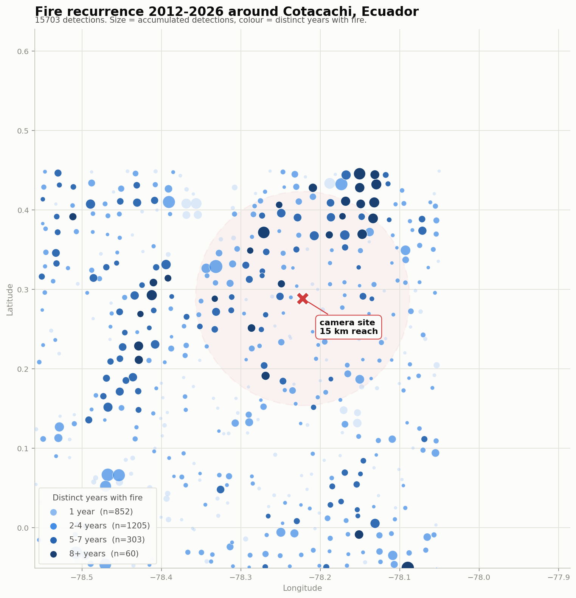

# firesite

Decide where to put a wildfire detection camera, using satellite fire history
instead of intuition.

Camera-based early wildfire detection works, and the open source stack for it
already exists. What is usually missing is the boring question asked first: on
which hill, pointing which way, with what lens. Get that wrong and the system
watches ground that never burns, or watches the right ground at a range where a
new plume covers four pixels. firesite answers it from 14 years of NASA FIRMS
detections.

**[Open the interactive viewer →](https://luisreinoso.dev/firesite/)**



## What it does

- Downloads active-fire history for any area on Earth, resumable, quota-aware.
- Filters out fixed thermal sources. Brick kilns, flares and quarries burn all
  year at low power, and because they recur they otherwise take the top of any
  recurrence ranking and point your camera at a factory.
- Ranks ground by **recurrence**, not by detection count. One enormous fire is
  less informative than a gully that burns most years.
- Grid-searches the positions that see the most of what has actually burned.
- Reports what one specific position would see, which is the question that
  matters once you know where you can get permission.
- Tells you which sensor and lens actually resolve those distances.
- Checks what the terrain actually lets you see, against a free global elevation
  model. This is usually the number that changes the answer.

That last part is the one people skip. A site can cover 60% of the historical
fires and still be useless:

```
which camera actually resolves those distances:
         optics  useful_range_km  detections_resolved  share_resolved
   4K, 55° lens             15.0                 1161           1.000
   4K, 70° lens             11.8                  555           0.478
1080p, 70° lens              5.9                   82           0.071
```

Same site, same fires. One camera catches everything, another catches 7%.

## Install

```bash
pip install firesite
```

Get a free FIRMS key at https://firms.modaps.eosdis.nasa.gov/api/map_key/ and
export it:

```bash
export FIRMS_MAP_KEY=your_key
```

## Use

```bash
# what date ranges are available right now
firesite availability

# pull 14 years around a point (note the = for negative coordinates)
firesite fetch --lat=0.2885 --lon=-78.2223 --radius 40 \
  --start 2012-01-20 --end 2026-08-01 \
  --sources VIIRS_SNPP_SP VIIRS_NOAA20_SP --output fires.csv

# which ground keeps burning
firesite rank fires.csv --timezone America/Guayaquil

# best positions anywhere in the area
firesite search fires.csv --radius 15

# same search, re-ranked by what the terrain actually lets each position see
firesite search fires.csv --radius 15 --viewshed

# which two positions cover the most between them
firesite search fires.csv --radius 15 --viewshed --cameras 2

# what a spot you can actually use would see
firesite evaluate fires.csv --lat=0.2885 --lon=-78.2223 --radius 15

# how much of that the terrain actually lets you see
pip install "firesite[terrain]"
firesite viewshed fires.csv --lat=0.2885 --lon=-78.2223 --radius 15

# a map
firesite map fires.csv --lat=0.2885 --lon=-78.2223 --output site.png

# JSON for the interactive viewer
firesite export fires.csv --lat=0.2885 --lon=-78.2223 --output my-area.json
```

Drop that JSON onto the [viewer](https://luisreinoso.dev/firesite/) to explore
it in a browser, or publish it yourself and point the page at it with
`?data=your-file.json`. Nothing is uploaded anywhere: the page reads the file
locally.

`evaluate` is the one to reach for in practice. Access beats optimality: a roof
you can mount on today is worth more than a perfect ridge you cannot reach.

### As a library

```python
import pandas as pd
from firesite import firms, evaluate_site

fires = firms.normalize(pd.read_csv("fires.csv"), timezone="America/Guayaquil")
report = evaluate_site(0.2885, -78.2223, fires, radius_km=15)

print(report["coverage"], report["sectors"])
print(report["optics"])
```

On a real Andean site, terrain turned out to hide almost half of it:

```
  55/125 cells have a clear line of sight
  625/1161 detections (54%) are actually visible
```

Raising the mast from 2 m to 20 m recovered two percentage points. The
obstruction is mountain-scale, so height does not fix it; a second camera does.

`search --viewshed` shortlists on range and then re-ranks on line of sight, which
routinely changes the answer. On a real Andean search the top two candidates were
tied on range and nowhere near tied in reality:

```
 lat    lon  in_range  visible share
0.32 -78.20      1358      577   42%
0.36 -78.20      1340      547   41%
0.36 -78.24      1360      391   29%   <- the range-only winner
0.40 -78.24      1290      170   13%
```

The position that looked best saw 29% of what it was ranked for. One that looked
fourth saw 13%: it would have been a wasted deployment.

`--cameras 2` then asks a different question: not which position is best, but
which pair covers the most between them. Greedy marginal gain, which for this
objective is guaranteed within 1 - 1/e of the optimum.

```
 lat    lon  adds  together of_visible
0.32 -78.20   577       577        61%
0.36 -78.24   178       755        80%
```

The second camera is the position that won on range and saw only 29% alone. As a
partner it is worth 178 detections the first cannot see, taking the pair from 61%
to 80% of everything visible in the area.

## What it will not do

- **The shortlist can still miss.** The terrain pass only re-ranks candidates the
  range-only stage surfaced, so a position that ranks 30th on range but sees
  everything is never considered. Raise `--top` to widen the net.
- **Satellites miss small fires.** VIIRS at 375 m sees the fire once it is
  already sizeable, which is exactly what a camera is meant to catch earlier. The
  history is therefore biased toward large events. Cross-check against fire
  service records where you can get them.
- **No hour-of-day analysis, on purpose.** Polar orbiters pass twice a day, so
  any hourly histogram of VIIRS data describes the orbit and not fire behaviour.
- The persistent-source filter is a heuristic. Review what it excluded against a
  satellite basemap; ground that genuinely burns year round would be caught too.

## How it compares to the literature

The method was built from first principles and checked against the published work
afterwards. Combining fire likelihood with siting optimization is an established
approach, accessibility is a formal criterion rather than a compromise, and a
15 km working radius sits in the usual range. Terrain was the outstanding gap and
`firesite viewshed` now closes the worst of it, though the position search itself
still does not account for visibility.
[`docs/literature.md`](docs/literature.md) sets out what held up, what was already
known, and which number here has no citation behind it.

## Where it fits

firesite stops at the decision of where to put the camera. For what runs on the
camera afterwards, see [Pyronear](https://github.com/pyronear): detection models,
edge runtime, alert API and platform, also Apache-2.0.

## Development

The analysis lives in pure functions: a frame goes in, a frame or a plain value
comes out, nothing is mutated and nothing is read from disk. Only the fetch, the
CLI and the plot writer touch the outside world. That is what makes the ranking
and the optics maths testable without a network or a fixture directory.

```bash
pip install -e ".[dev]"
pytest
```

Tests came first and found four real defects worth naming, since each one would
have been silent in production: a bounding box around a point near the poles was
invalid rather than clamped; `top=0` returned everything instead of nothing
because zero is falsy; ties in the site search were resolved by iteration order,
so the winner drifted to the edge of the cluster it covered rather than its
middle; and the negative-coordinate shim fused `--lat --lon 1.0` into
`--lat=--lon`, turning a plain user error into an unreadable float parse failure.

See [CONTRIBUTING.md](CONTRIBUTING.md). The most wanted contributions are a
terrain and line-of-sight model, multi-camera placement, and fire histories from
regimes the persistent-source filter has never been tested against.

## Data

NASA FIRMS, free with attribution. Cite as: NASA FIRMS, Fire Information for
Resource Management System, https://firms.modaps.eosdis.nasa.gov/.

## Licence

Apache-2.0.

---

# firesite (español)

Decide dónde poner una cámara de detección de incendios usando el historial
satelital, en vez de la intuición.

La detección temprana por cámara funciona y el stack abierto para hacerla ya
existe. Lo que suele faltar es la pregunta aburrida que va primero: en qué cerro,
mirando hacia dónde, con qué lente. Si eso sale mal, el sistema vigila terreno
que nunca arde, o vigila el terreno correcto a una distancia donde una columna de
humo nueva ocupa cuatro píxeles. firesite lo responde con 14 años de detecciones
de NASA FIRMS.

## Qué hace

- Descarga el historial de incendios de cualquier zona del mundo. Reanudable y
  con control de cuota.
- Descarta fuentes térmicas fijas. Los hornos de ladrillo, las canteras y los
  quemadores industriales arden todo el año a baja potencia y, como se repiten,
  encabezan cualquier ranking por recurrencia y terminan apuntando tu cámara a
  una fábrica.
- Rankea el terreno por **recurrencia**, no por número de detecciones. Un
  incendio enorme informa menos que una quebrada que arde casi todos los años.
- Busca en malla las posiciones que ven más de lo que realmente ardió.
- Evalúa un punto concreto, que es la pregunta útil cuando ya sabes dónde te dan
  permiso.
- Te dice qué sensor y qué lente resuelven de verdad esas distancias.

Esa última parte es la que todo el mundo se salta. Un sitio puede cubrir el 60%
de los incendios históricos y aun así no servir, porque a 15 km una columna
incipiente no llega a los píxeles que necesita el detector.

## Instalar y usar

```bash
pip install firesite
export FIRMS_MAP_KEY=tu_clave   # gratis en firms.modaps.eosdis.nasa.gov/api/map_key/

# ojo con el = en coordenadas negativas
firesite fetch --lat=0.2885 --lon=-78.2223 --radius 40 \
  --start 2012-01-20 --end 2026-08-01 \
  --sources VIIRS_SNPP_SP --output fires.csv

firesite evaluate fires.csv --lat=0.2885 --lon=-78.2223 --radius 15
```

`evaluate` es el comando que más vas a usar. El acceso vale más que la
optimización: un techo donde puedes montar hoy supera a la loma perfecta a la que
no puedes subir.

## Lo que no hace

- **No modela el terreno.** La posición ganadora puede estar detrás de una loma.
  Contrasta con un mapa topográfico.
- **El satélite no ve el conato.** VIIRS a 375 m detecta el incendio cuando ya es
  grande, justo lo que la cámara debería cazar antes. El histórico está sesgado
  hacia eventos grandes. Contrasta con los partes del cuerpo de bomberos.
- **No analiza la hora del día, a propósito.** Los satélites de órbita polar
  pasan dos veces al día, así que cualquier histograma horario describe la órbita
  y no el comportamiento del fuego.
- El filtro de fuentes fijas es una heurística. Revisa lo que excluyó sobre una
  imagen satelital.

## Dónde encaja

firesite termina cuando ya sabes dónde va la cámara. Para lo que corre después
dentro de ella, mira [Pyronear](https://github.com/pyronear): modelos de
detección, runtime en el borde, API de alertas y plataforma, también Apache-2.0.
